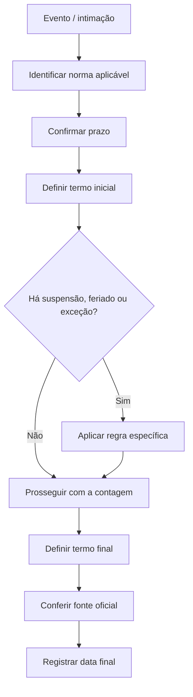

# Template — Prazo processual visual

> Este arquivo é um **modelo de preenchimento**. Não contém prazo jurídico concreto porque o currículo-base não fornece uma situação processual, legislação ou regra de contagem específica.

## Dados necessários antes de preencher

- Processo/procedimento:
- Ato processual:
- Norma aplicável:
- Data do evento inicial:
- Forma de intimação/publicação:
- Prazo previsto:
- Unidade de contagem:
- Regra de início:
- Regra de término:
- Suspensões/feriados/exceções:
- Fonte oficial consultada:

## Fluxograma

## Registro da contagem

| Item | Informação |
|---|---|
| Evento inicial | |
| Termo inicial | |
| Prazo | |
| Suspensões/exceções | |
| Termo final | |
| Fonte oficial | |
| Data da conferência | |
