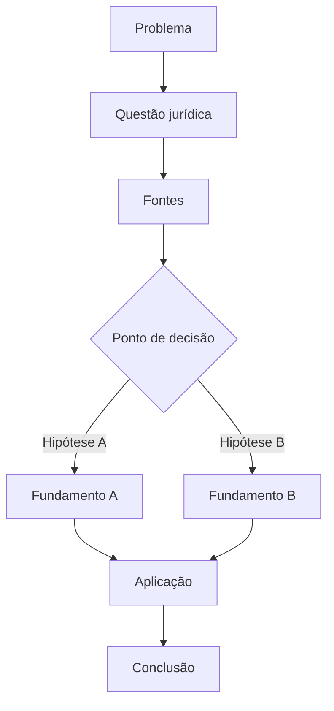

# Template — Tese jurídica visual

## Identificação
- Tema:
- Disciplina:
- Data:
- Fontes principais:

## Fluxograma

## Checklist de qualidade

- [ ] A pergunta jurídica está delimitada.
- [ ] As fontes foram identificadas.
- [ ] As afirmações têm fonte correspondente.
- [ ] Exceções foram registradas.
- [ ] Posições divergentes foram separadas.
- [ ] A conclusão não extrapola as fontes.
