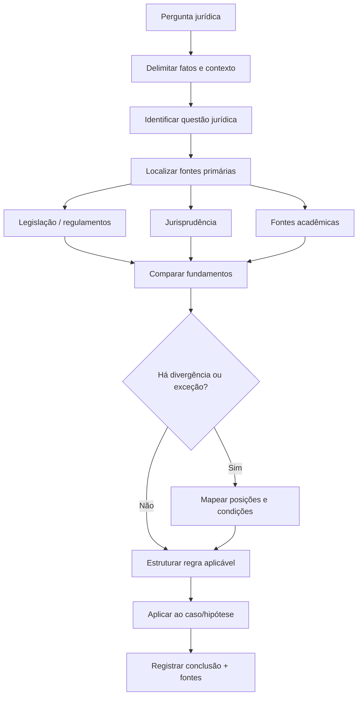

# 01 — Fluxo de pesquisa jurídica

Este primeiro fluxograma é um **modelo metodológico**, não uma tese jurídica específica.

Ele organiza a pesquisa de modo compatível com o perfil acadêmico e técnico descrito no currículo.

## Ficha rápida

| Elemento | Registro |
|---|---|
| Pergunta | _Preencher_ |
| Fatos relevantes | _Preencher_ |
| Questão jurídica | _Preencher_ |
| Fontes primárias | _Preencher_ |
| Jurisprudência | _Preencher_ |
| Doutrina/artigos | _Preencher_ |
| Exceções | _Preencher_ |
| Aplicação | _Preencher_ |
| Conclusão | _Preencher_ |

## Nota de origem

O currículo informa atuação em pesquisa técnica e acadêmica, redação técnica, relatórios e documentação extensa, além de interesse em Direito Digital, LegalTech, Proteção de Dados, IA e Pesquisa Jurídica.
