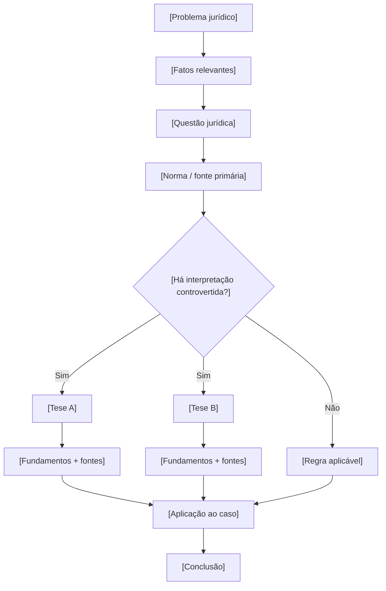

# 02 — Modelo visual de tese jurídica

> **Template:** substituir os campos entre colchetes por conteúdo efetivamente pesquisado e citar as fontes utilizadas.

## Estrutura acadêmica

### 1. Problema
[Descrever o problema de forma objetiva.]

### 2. Questão jurídica
[Formular a pergunta que será respondida.]

### 3. Fontes
- [Lei / regulamento]
- [Jurisprudência]
- [Artigo / livro]
- [Fonte institucional]

### 4. Tese ou entendimento
[Descrever sem extrapolar o que as fontes sustentam.]

### 5. Contra-argumentos
[Registrar interpretações alternativas e respectivas fontes.]

### 6. Aplicação
[Explicar como a regra ou interpretação se relaciona com os fatos.]

### 7. Conclusão
[Conclusão delimitada ao problema pesquisado.]
